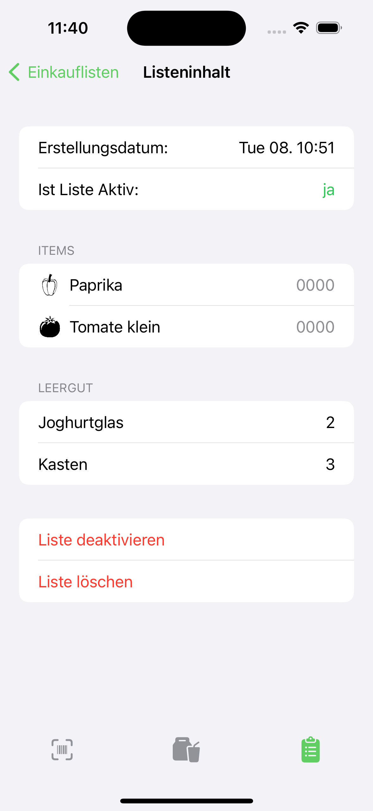

[](https://img.shields.io/github/last-commit/AKORA-Studios/VGApp/main)
[](https://img.shields.io/github/last-commit/AKORA-Studios/VGApp/main)
[](https://img.shields.io/github/last-commit/AKORA-Studios/VGApp/main)

# VGApp

Scannen von Barcodes in Bioläden, sodass man diese nicht mehr nervig auf Zettel schreiben muss :3

## Features

- Scannen von Barcodes und das daraus lesen der Gemüse/Obst-Nummer
- Speichern von Einkäufen
- Speichern von abgegebenen Pfand
- Speichern von Nummern mit zugehörigem gemüse/Obst -> Autocomplete on scan

## Showcase




<details closed>
  <summary>More Pictures</summary>


</details>

## How to Install and Run the Project

```CMD
git clone https://github.com/AKORA-Studios/VGApp
```

- Open the workspace file in Xcode
- Use **CMD + R** to run the app sheme named "VGApp"

## Requirements

- iOS 15.0+
- Xcode Xcode 12.1
  
## Contributors

<a href = "https://github.com/AKORA-Studios/VGApp/graphs/contributors">
  
</a>
